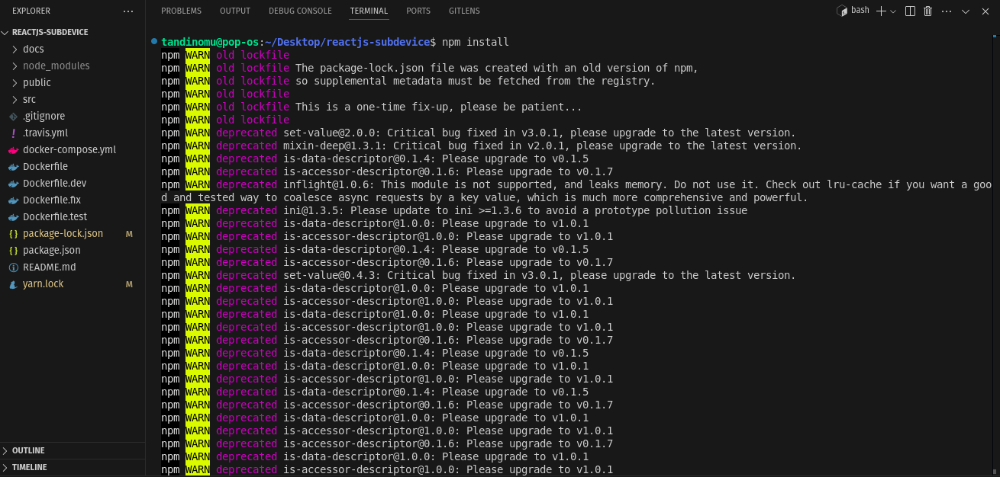
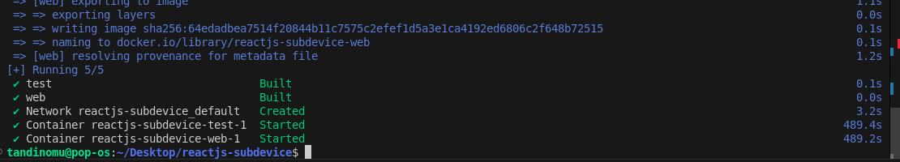

# Practical Report: Docker Containerization for React.js Application

## Introduction

Docker is a containerization platform used to package applications along with their dependencies into containers. This ensures that applications run seamlessly across different environments, including development, testing, and production. This report documents the process of containerizing a React.js application as shown in the screenshots.

## Containerization

This is the process of packaging an application and its dependencies (libraries, runtime, system tools, etc.) into a single, self-contained unit called a container. 

## Steps Followed for Docker Containerization Exercise

### 1. Installing Dependencies



```bash
npm install
```

The terminal output shows several deprecated packages and warnings related to package versions, which is typical during npm installations. 

### 2. Docker Build Process

The Docker build process was executed with:



The screenshots show the build process including:
- Loading build definition from Dockerfile
- Transferring the Docker context
- Loading metadata for the docker.io/library/node:alpine image
- Transferring layers and files
- Caching packages for efficient build
- Executing npm install with legacy peer dependencies flag
- Building the application
- Exporting layers and the final image

### 3. Running Docker Containers

After successful build, containers were launched with:

```bash
docker run -d -p 3000:3000 tandinomu/react-app
```

And later:

```bash
docker run -d -p 81:80 sha256:6c41dda2ab1bb448c413a5f4bfc3e0c6fbeee64b124c52ea2c118ca8cb55e2ce
```

This maps port 81 on the host to port 80 in the container.

### 4. Checking Container Status

To verify running containers, the command was used:

```bash
docker ps
```

The output shows three containers running:
- A container with ID starting with 1c7ceb10efc (tandinomu/react-app)
- A container with ID starting with e0631ff83c75 (reactjs-subdevice-web)
- A container with ID starting with 6abfd67c6d52 (reactjs-subdevice-test)

All containers were successfully running with port mapping 3000:3000/tcp for the first two and a unique name for each container.

An additional container was later launched with name "bold_booth" with port mapping 81:80/tcp.

### 5. Running Tests

The application has test capability, with a test suite that successfully passed:

```
PASS src/App.test.js
✓ renders without crashing (30ms)

Test Suites: 1 passed, 1 total
Tests:       1 passed, 1 total
Snapshots:   0 total
Time:        10.631s, estimated 67s
```

The test output shows options to:
- Press f to run only failed tests
- Press o to only run tests related to changed files
- Press p to filter by a filename regex pattern
- Press q to quit watch mode
- Press t to filter by a test name regex pattern
- Press Enter to trigger a test run

### 6. Dockerfile for Production

A multi-stage Dockerfile was created to optimize the production build. The second build shown in the screenshots represents this process, with a successful build producing a container that was then run with port 81 mapped to container port 80.

## Docker Command Reference

Based on the screenshots, the following Docker commands were used:

```bash
# Build Docker image
docker build .

# Run container with port mapping
docker run -d -p 3000:3000 tandinomu/react-app
docker run -d -p 81:80 [IMAGE_ID]

# Check running containers
docker ps
```

## Conclusion

The Docker containerization of the React.js application was successful. Three containers were created and run successfully with appropriate port mappings. The application's test suite passed, confirming that the containerization did not affect the application functionality.